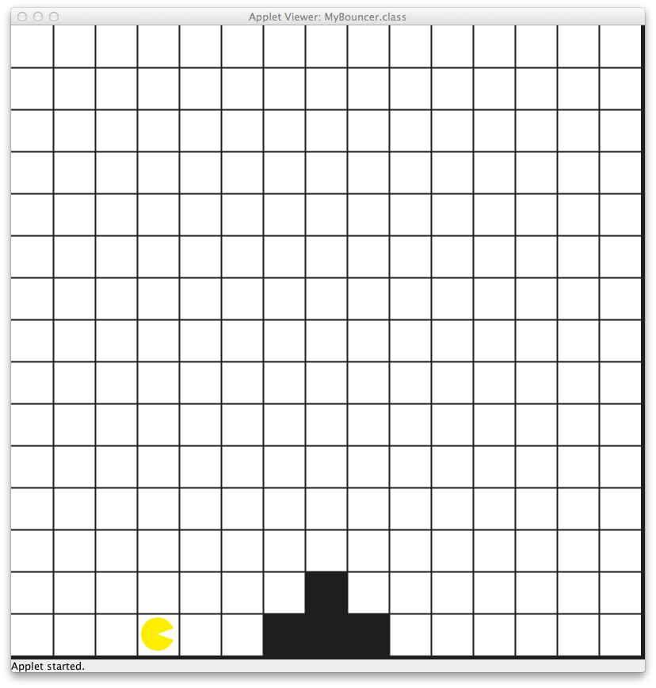

# Erste Schritte mit Bouncer

## Wichtige Informationen zur Bearbeitung der Aufgabe 
 - [Informationen zur Entwicklungsumgebung *IntelliJ IDEA*](https://elearning.uni-regensburg.de/mod/book/view.php?id=1480675)
 - [Informationen zum Im- und Export von Projekten](https://elearning.uni-regensburg.de/mod/book/view.php?id=1480675&chapterid=51551)
 - [Bouncer](https://elearning.uni-regensburg.de/mod/book/view.php?id=1480680/)

## Starterpaket

Ein vorbereitetes Starterpaket zur selbständigen Implementierung der Aufgabe finden Sie [hier](https://github.com/OOP-Ubungen-WS2020-21/U01-Erste-Schritte-mit-Bouncer/archive/Starterpaket.zip).

## **Bouncer und das erste Hindernis**


Bouncers Welt ist 2-dimensional und wir betrachten sie von der Seite. Der untere Kartenrand stellt den Boden der Welt da, der obere ist die Decke. In der Welt gibt es keine Schwerkraft, d.h. Bouncer kann jedes freie Feld betreten und dazu auch an der *Wand hoch laufen*.

Bouncers Welt sieht in dieser Aufgabe wie folgt aus:

<p align="center">

</p>

Bouncer steht in einer leeren Welt, die außer ihm nur ein zwei Felder
hohes Hindernis beeinhaltet. Bouncer soll bis zu diesem Hindernis
laufen, über die gesperrten Felder hinüber klettern und auf der
gegenüberliegenden Seite bis zur Wand laufen um dort stehenzubleiben.
*Benutzen Sie die Karte **Obstacles** um die korrekte Welt zu laden
(Siehe dazu im Handout zu Bouncer: `loadMap()`).*

Dieses Beispiel ist einfach und Sie können auf die folgenden Annahmen
bauen: Bouncer startet drei Felder vor dem Hindernis auf dessen linken
Seite. Er schaut zu Beginn nach Osten, Die Welt sieht immer exakt so aus
wie in der Abbildung dargestellt, d.h. das Hindernis ist gleich hoch und
immer an der gleichen Position.

Die Aufgabe besteht daraus, die Kommandos für Bouncer zu schreiben, um
die folgenden Teilaufgaben zu lösen.

1.  Bis zum Hindernis laufen

2.  Am Hindernis auf der linken Seite hoch klettern

3.  Am Hindernis auf der rechten Seite herunter klettern

4.  Bis zur rechten Wand der Karte weitergehen

**Hinweise:** Schreiben Sie eine eigene `private`-Methode für jeden der oben
dargestellten Schritte. Ziel der Übung ist es mit dem grundsätzlichen
Programmablauf vertraut zu werden und Übung darin zu bekommen, Probleme
in kleinere Teilaufgaben zu zerlegen (*Decomposition*). Achten Sie
darauf, sowohl den Code als auch die Kommentare (z.B. *pre*- und
*post-conditions*) in Englisch zu schreiben. Verwenden Sie
aussagekräftige Bezeichnungen für Ihre eigenen Methoden.

## Bouncer repariert eine Straße

Bouncer steht auf einer grünen Straße mit einigen Schlaglöchern (rot).
Bouncers Aufgabe ist es die komplette Straße zu überprüfen und alle
zerstörten Stellen auszubessern. Am Ende sollen alle Felder der Straße
grün eingefärbt sein:

<p align="center">


</p>

Die Ausgangsbedingung für diese Aufgabe ist wie folgt: Bouncer steht am unteren Kartenrand auf dem ersten Feld (0,14) der Straße und schaut nach Osten. Die Straße führt bis zur gegenüberliegenden Wand und beeinhaltet verschiedene Schlaglöcher.

Lösen Sie folgende Teilaufgaben, um die Straße zu reparieren:

1.  Bouncer muss die komplette Straße überprüfen, d.h. er muss bis zur
    gegenüberliegenden Wand laufen

2.  Auf jedem Feld muss er überprüfen, ob dieses intakt *grün* bzw.
    defekt (rot) ist

3.  Kaputte Felder werden repariert, in dem sie grün eingefärbt werden: `FieldColor.GREEN`

*Benutzen Sie die Karte **Street** um die korrekte Welt zu laden*.
Beachten Sie, dass Sie das letzte Feld möglicherweis gesondert
betrachten müssen. Die Farbe eines Feldes können Sie mit dem Befehl `isOnFieldWithColor()` erfragen. In den runden Klammern fügen Sie die Farbe ein, die sie überprüfen wollen. Entweder `FieldColor.RED`, `FieldColor.GREEN` oder `FieldColor.BLUE`.

**Beispiel:** Verwenden Sie eine `if`-Abfrage, um Informationen über Bouncers Umgebung zu erhalten. Wenn Sie wissen möchten, ob das Feld vor Bouncer frei ist, können Sie folgende Konstruktion verwenden:

```java
if(bouncer.canMoveForward()) {
    // Die Befehle zwischen diesen Klammern werden nur dann
    // ausgefuehrt, wenn das Feld vor Bouncer frei ist.
}
```

**Beispiel:** Verwenden die -Anweisung um Bouncer Dinge so lange tun zu lassen, bis eine bestimmte Situation eintritt. Um Bouncer so lange in die aktuelle Blickrichtung laufen zu lassen, bis er an den Kartenrand oder ein blockiertes Feld stößt, können Sie diese Konstruktion verwenden:

```java
while(bouncer.canMoveForward()) {
    move();
}
```

## Bouncer als Maler

Bouncers Aufgabe in diesem Programm ist es, einen Raum komplett in rot
zu streichen. Dazu muss er den Raum betreten und dort alle Felder rot
anmalen. Der Raum ist durch gesperrte Felder von der restlichen Karte
abgetrennt. Bouncer startet zwei Felder vor der *Tür*.

<p align="center">


</p>


*Benutzen Sie die Karte **Painter** um die korrekte Welt zu laden*. Ihr Programm sollte jedoch allgemein genug verfasst sein, um auch andere Räume verabeiten zu können. Sie können die Allgemeingültigkeit Ihres Programmes mit der Karte **Painter_large** testen. Es gelten folgende Annahmen:

-   Der Raum befindet sich östlich von Bouncer

-   Bouncer startet immer am unteren Rand der Karte, steht mindestens
    ein Feld vor der *Tür* und schaut nach Osten

-   Die Öffnung (*Tür*) ist ein Feld breit und hoch und befindet sich
    auf gleicher Höhe mit Bouncers Startposition

-   Der Raum kann auf der Karte beliebig hoch und breit sein

-   Bis auf die Öffnung ist der Raum durch blockierte Felder bzw. den
    Kartenrand umgeben

-   Nachdem Bouncer den Raum betreten hat und auf dem ersten Feld hinter
    der Tür steht, soll er mit dem Streichen beginnen. Dabei arbeitet er
    senkrecht vom Boden zur Decke und bewegt sich danach - am Boden -
    ein Feld Richtung Osten um erneut vom Boden bis zur Decke alle
    Felder der aktuellen *Spalte* anzumalen.

Zerlegen Sie die Hauptaufgabe in sinnvolle Teilbereiche, die Sie 
nacheinander bearbeiten. Überlegen Sie sich, welche Bedingungen
oder Zustände auftreten, die das Ende bzw. den Start einer der
Teilaufgaben beschreiben:

1.  Betreten des Raums

2.  Klettern bis zur Decke und Streichen aller Felder

3.  Rückkehr zum Boden und Wechsel zum nächsten Feld

4.  Weitermachen, bis Bouncer den Raum komplett gestrichen hat
